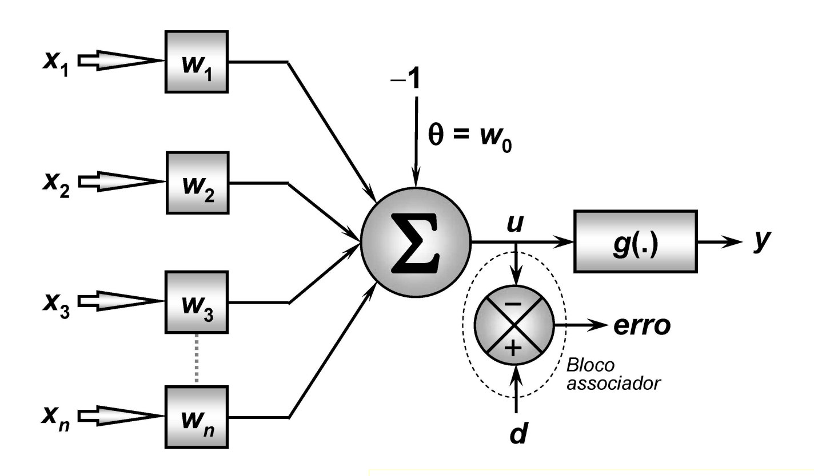
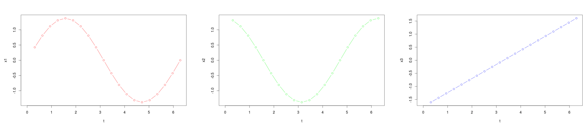

```{r setup, include=FALSE}
knitr::opts_chunk$set(echo = TRUE, fig.width = 10, fig.align = 'center')
require('ggplot2')
require('plotly')
set.seed(102030)
```

## ADALINE
ADALINE é o algoritimo acrônimo de **Adaptive Linear Element** criado por Bernard Widrow e Marcian Hof na Universidade de Stanford em 1960. 

Essa metodologia é um clássico modelo de neurônio que permite saídas tanto diretas quanto contínuas e pode ser usado para tarefas de classificação e regressão.

A função de ativação do neurônio **ADALINE** é :
$$ y=\sum _{{j=1}}^{{n}}x_{j}w_{j}+\theta  $$

Onde:

- $x$ é o vetor de entrada
- $w$ é o vetor de pesos
- $n$ é o número de entradas
- $\theta$ é uma constante
- $y$ é a saída do modelo

O formato da rede é :
```{r, eval = TRUE, echo = FALSE, out.width = "800px", fig.align = 'center'}

```


## Exercício ADALINE 01

Um estudante de engenharia estava fazendo o estudo de um sistema e durante um intervalo de tempo ele observou na entrada (x) uma senoide diferente daquela encontrada na saída (y), o aluno concluiu que aquela senoide da entrada havia sido multiplicada por um termo e somada a outro de forma que y = $a+ b*x$. O estudante então pediu a você para encontrar estes parâmetros utilizando os conceitos da Adaline que você aprendeu. Para isso ele te forneceu o tempo de amostragem $Ex1_t$, os pontos de entrada $Ex1_x$ e a saída $Ex1_y$ Para achar os parâmetros você deverá usar 70% dos dados para treinamento e 30% para teste. Calcule o erro médio quadrático para as amostras de teste e plote o gráfico da saída, considerando os parâmetros encontrados, para todos os pontos da entrada. Quais são os parâmetros do modelo?

#### Gerando os Dados
```{r, echo = TRUE}
t <- read.table(file = './Ex1_t', header = TRUE, sep = ' ')
X <- read.table(file = './Ex1_x', header = TRUE, sep = ' ')
Y <- read.table(file = './Ex1_y', header = TRUE, sep = ' ')

t <- as.numeric(t$x)
X <- as.numeric(X$x)
Y <- as.numeric(Y$x)
```

#### Visualizando os Dados
```{r, echo = TRUE, message = FALSE, warning = FALSE}
p <- ggplot2::ggplot(data = NULL) +
      ggplot2::geom_point(aes(x = t, y = X, color = 'entrada')) + 
      ggplot2::geom_point(aes(x = t, y = Y, color = 'saida')) + 
      ggplot2::geom_line(aes(x = t, y = X, color = 'entrada')) + 
      ggplot2::geom_line(aes(x = t, y = Y, color = 'saida'))
plotly::ggplotly(p)
```

#### Separando Treinamento x Teste
```{r}
trainPerc <- 0.7
nSamples <- length(t)
nTrainSamples <- round(0.7 * length(t))
trainPos <- sample(nSamples, nTrainSamples )

tTrain <- t[trainPos]
XTrain <- X[trainPos]
YTrain <- Y[trainPos]

tTest <- t[-trainPos]
XTest <- X[-trainPos]
YTest <- Y[-trainPos]
```

#### Visualização dos Dados de Treinamento
```{r, echo = TRUE, message = FALSE, warning = FALSE}
p <- ggplot2::ggplot(data = NULL) +
      ggplot2::geom_point(aes(x = tTrain, y = XTrain, color = 'entrada de treinamento')) + 
      ggplot2::geom_point(aes(x = tTrain, y = YTrain, color = 'saida de treinamento')) + 
      ggplot2::geom_line(aes(x = tTrain, y = XTrain, color = 'entrada de treinamento')) + 
      ggplot2::geom_line(aes(x = tTrain, y = YTrain, color = 'saida de treinamento'))
plotly::ggplotly(p)
```

#### Criando o Adaline
```{r}
adalineSolver <- function(X, Y,
                          eta = 1e-1, tol = 0.001,
                          maxepocas = 10000, par = 0,
                          verbose = TRUE, verboseMultEpocas = 50){
    
  nObs <- length(Y)
  pos <- sample(nObs)
  
  Y <- Y[pos]
  if(class(X) == 'matrix') {
    X <- as.matrix(X[pos, ])
  } else{
    X <- as.matrix(X[pos])
  }
  
  N <- dim(X)[1] #recebe as linhas
  n <- dim(X)[2] # recebe as colunas
  
  if (par == 1){
    wt <- as.matrix( runif(n+1) - 10^(-n - 2) ) #inicializa um vetor de n+1 elementos
    X <- cbind(1, X)
  } else if (par == 0){
    wt <- as.matrix(runif(n) - 0.5)  #inicializa um vetor de n+1 elementos
  }

  nepocas <- 0
  eepoca <- tol + 1
  
  #inicializa vetor erro evec, 
  evec <- matrix( nrow = 1, ncol = maxepocas)
  
  while ( (nepocas < maxepocas) && (eepoca > tol) )  #eepocas erro da epoca e tol tolerancia
  {
    if( ( verbose ) && ( (nepocas %% verboseMultEpocas) == 0 ) ){
      print( paste('Epoch = ', nepocas, ' -  at = ', Sys.time()) )
    }
    
    ei2 <- 0
    
    #sequencia aleatoria para treinamento
    xseq <- sample(N)
    
    for (i in 1:N)
    {
      #padrao para sequencia aleatoria
      irand <- xseq[i]
      yhati <- X[irand, ] %*% wt
      ei <- Y[irand] - yhati
      dw <- eta * ei * X[irand, ] 
      
      #atualizacao do peso w
      wt <- wt + dw
      
      #erro acumulado
      ei2 <- ei2 + ei*ei
    }
    
    #numero de epocas
    nepocas <- nepocas + 1
    evec[nepocas] <- ei2 / N
    
    #erro por epoca
    eepoca <- evec[nepocas]
  }

  list(wt = wt,
       evec = evec[1:nepocas])

}
```

#### Aplicando o Adaline
```{r}
result <- adalineSolver(X = XTrain, Y = YTrain, 
                        eta = 0.01, tol = 0.001, maxepocas = 100,
                        par = 1, verboseMultEpocas = 10)

print( paste('Adaline Weights -> a =', round(result$wt[1], 4),
             'and b =', round(result$wt[2]), 4) )
```

#### Visualizando o erro de treinamento do Adaline
```{r, warning = FALSE, error = FALSE}
Error <- result$evec
p <- ggplot2::ggplot(data = NULL, aes(x = 1:length(Error), y = Error)) +
      ggplot2::geom_line() + 
      ggplot2::geom_point()
plotly::ggplotly(p)
```

#### Calculando a Predição
```{r}
predAdaline <- function(X, w, par){
  if(class(X) != 'matrix'){
    X <- as.matrix(X)  
  }
  
  if(par == 1){
      X <- cbind(1, X)
  }
  
  u <- X %*% w
  Y <- u
  
  Y
}
```

```{r}
YHat <- predAdaline(X = XTest, w = result$wt, par = 1)
```

### Analisando a Predição
```{r}
p <- ggplot2::ggplot(data = NULL) + 
      ggplot2::geom_line(aes(x = t, y = X, color = 'Entrada')) + 
      ggplot2::geom_point(aes(x = t, y = X, color = 'Entrada')) +
      ggplot2::geom_line(aes(x = t, y = Y, color = 'Saida')) + 
      ggplot2::geom_point(aes(x = t, y = Y, color = 'Saida')) + 
      ggplot2::geom_line(aes(x = tTest, y = XTest, color = 'Entrada Teste')) + 
      ggplot2::geom_point(aes(x = tTest, y = XTest, color = 'Entrada Teste', size = 2)) +
      ggplot2::geom_line(aes(x = tTest, y = YTest, color = 'Saida Teste')) + 
      ggplot2::geom_point(aes(x = tTest, y = YTest, color = 'Saida Teste', size = 2)) + 
      ggplot2::geom_line(aes(x = tTest, y = YHat, color = 'Saida Teste Predição')) + 
      ggplot2::geom_point(aes(x = tTest, y = YHat, color = 'Saida Teste Predição', size = 2))

plotly::ggplotly(p)
```

```{r}
p <- ggplot2::ggplot(data = NULL) + 
      ggplot2::geom_line(aes(x = X, y = Y, color = 'Dado Original')) + 
      ggplot2::geom_point(aes(x = X, y = Y, color = 'Dado Original')) +
      ggplot2::geom_line(aes(x = XTest, y = YTest, color = 'Dado Original Teste')) + 
      ggplot2::geom_point(aes(x = XTest, y = YTest, color = 'Dado Original Teste', size = 2)) +
      ggplot2::geom_line(aes(x = XTest, y = YHat, color = 'Dado Predição Teste')) + 
      ggplot2::geom_point(aes(x = XTest, y = YHat, color = 'Dado Predição Teste', size = 2))

plotly::ggplotly(p)
```
```{r}
RMSE <- sqrt( sum(YTest - YHat) ** 2 )
print( paste('RMSE de Teste =', RMSE) )
```


## Exercício ADALINE 02
O mesmo estudante de engenharia ficou admirado com seus conhecimentos técnicos sobre Adaline e resolveu pedir mais um favor. Ele observou que o novo sistema que ele estava trabalhando era constituído de três sinais na entrada e que a saída era uma mistura destes sinais da entrada mais um ganho. Mas este estudante não sabia muito bem como era esta mistura de sinais, a única coisa que ele sabia era que: y = a + $b*x_1$ + $b*x_2$ + $b*x_3$. O aluno amostrou então os sinais na entrada e na saída para o intervalo de [0.1$\pi$/ : 2$\pi$] e os armazenou nas variáveis t (tempos amostrais), x (entradas) e y (saída). Sendo que a primeira coluna de x é o sinal x1, a segunda x2 e a terceira x3. Para achar os parâmetros você deverá usar 70% dos dados para treinamento e 30% para teste. Calcule o erro médio quadrático para as amostras de teste e plote o gráfico da saída, considerando os parâmetros encontrados, para todos os pontos da entrada. Quais são os parâmetros do modelo?

```{r, eval = TRUE, echo = FALSE, out.width = "800px", fig.align = 'center'}

```

#### Gerando os Dados
```{r}
nSamples <- 20
t <- seq(from = 2 * (pi/nSamples), to = 2 * pi, by = 2 * (pi/nSamples) )
X1 <- scale( x = sin(t) )
X2 <- scale( x = cos(t) )
X3 <- scale( x = t )
X <- cbind(X0 = 1,
           X1 = as.numeric(X1),
           X2 = as.numeric(X2),
           X3 = as.numeric(X3))
w <- as.matrix( c(a = pi/2, b = 1, c = 2, d = 3) )
Y <- X %*% w
```

#### Visualização dos Dados
```{r, warning = FALSE, message = FALSE}
p <- ggplot2::ggplot(data = NULL) +
      ggplot2::geom_line(aes( x = t, y = Y, color = 'Saida')) +
      ggplot2::geom_point(aes( x = t, y = Y, color = 'Saida')) +
      ggplot2::geom_line(aes( x = t, y = X[, 1], color = colnames(X)[1])) +
      ggplot2::geom_point(aes( x = t, y = X[, 1], color = colnames(X)[1])) +
      ggplot2::geom_line(aes( x = t, y = X[, 2], color = colnames(X)[2])) +
      ggplot2::geom_point(aes( x = t, y = X[, 2], color = colnames(X)[2])) + 
      ggplot2::geom_line(aes( x = t, y = X[, 3], color = colnames(X)[3])) +
      ggplot2::geom_point(aes( x = t, y = X[, 3], color = colnames(X)[3])) +
      ggplot2::geom_line(aes( x = t, y = X[, 4], color = colnames(X)[4])) +
      ggplot2::geom_point(aes( x = t, y = X[, 4], color = colnames(X)[4])) 
plotly::ggplotly(p)
```

#### Separação Treinamento e Teste
```{r}
trainPerc <- 0.7
nSamples <- length(t)
nTrainSamples <- round(0.7 * length(t))
trainPos <- sample(nSamples, nTrainSamples )

tTrain <- t[trainPos]
XTrain <- X[trainPos, ]
YTrain <- Y[trainPos]

tTest <- t[-trainPos]
XTest <- X[-trainPos, ]
YTest <- Y[-trainPos]
```

#### Visualização Saida de Treinamento
```{r, warning = FALSE, error = FALSE}
p <- ggplot2::ggplot(data = NULL) + 
      ggplot2::geom_line(aes( x = t, y = Y, color = 'Saida')) +
      ggplot2::geom_point(aes( x = t, y = Y, color = 'Saida'))  +
      ggplot2::geom_point(aes(x = tTrain[order(tTrain)], y = YTrain[order(tTrain)],
                          color = 'Saida de Teste', size = 2) )

plotly::ggplotly(p)
```

```{r}
result <- adalineSolver(X = XTrain, Y = YTrain, 
                        eta = 0.005, tol = 0.001, maxepocas = 1000,
                        par = 1, verboseMultEpocas = 10)
YHat <- predAdaline(X = XTest, w = result$wt, par = 1)

RMSE <- sqrt( sum(YTest - YHat) ** 2 )

print( paste('Adaline Weights -> a =', round(result$wt[1], 4),
             'and b =', round(result$wt[2], 4),
             'and c =', round(result$wt[3], 4),
             'and d =', round(result$wt[4], 4) ))
print( paste('RMSE de Teste =', RMSE) )
```

### Analisando a Predição
```{r, warning = FALSE, error = FALSE}
p <- ggplot2::ggplot(data = NULL) + 
      ggplot2::geom_line(aes(x = t, y = Y, color = 'Saida')) + 
      ggplot2::geom_point(aes(x = t, y = Y, color = 'Saida')) + 
      ggplot2::geom_point(aes(x = tTest[order(tTest)], y = YTest[order(tTest)],
                              color = 'Saida Teste', size = 1.5)) + 
      ggplot2::geom_line(aes(x = tTest, y = YHat, color = 'Saida Teste Predição')) + 
      ggplot2::geom_point(aes(x = tTest, y = YHat, color = 'Saida Teste Predição', size = 1.5))

plotly::ggplotly(p)
```

```{r, warning = FALSE, error = FALSE}
YHat <- predAdaline(X = X, w = result$wt, par = 1)
p <- ggplot2::ggplot(data = NULL) + 
      ggplot2::geom_line(aes(x = t, y = Y, color = 'Saida')) + 
      ggplot2::geom_point(aes(x = t, y = Y, color = 'Saida')) + 
      ggplot2::geom_line(aes(x = t, y = YHat, color = 'Saida Teste Predição')) + 
      ggplot2::geom_point(aes(x = t, y = YHat, color = 'Saida Teste Predição'))

plotly::ggplotly(p)
```