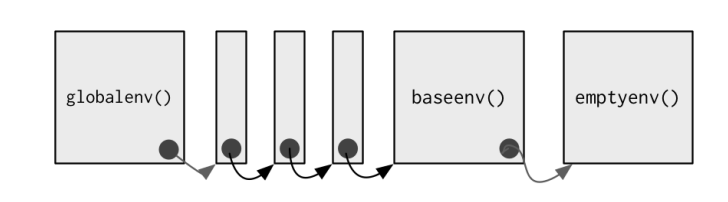
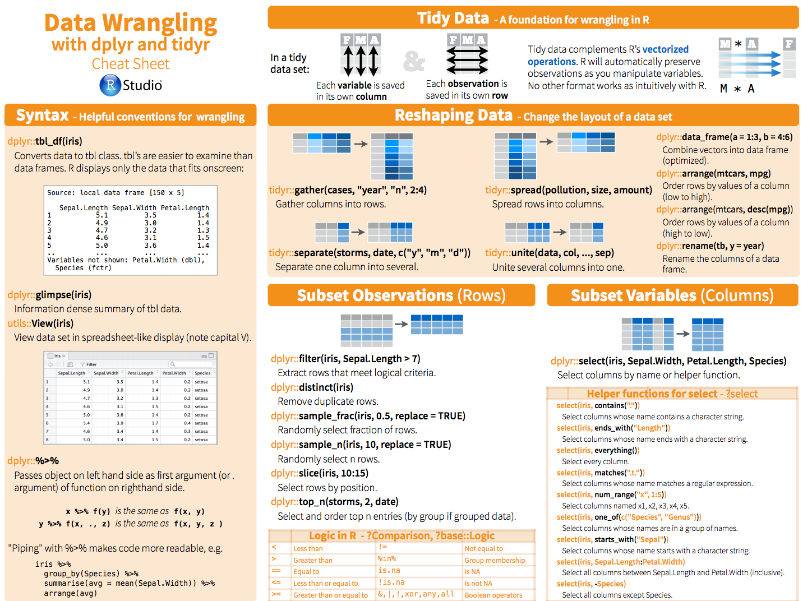
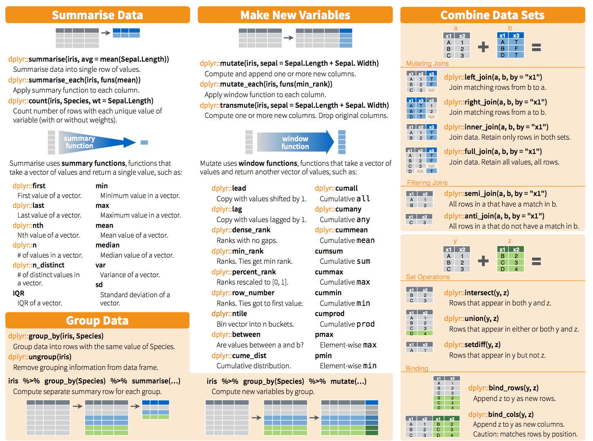
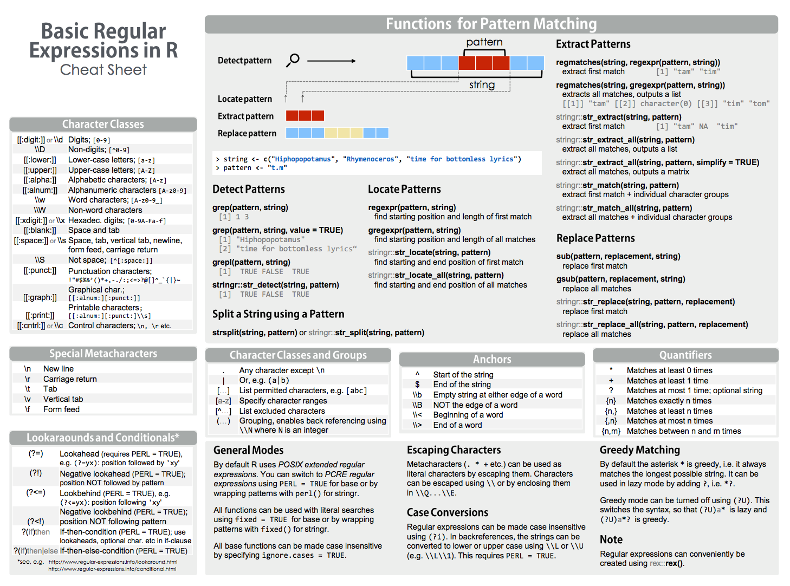
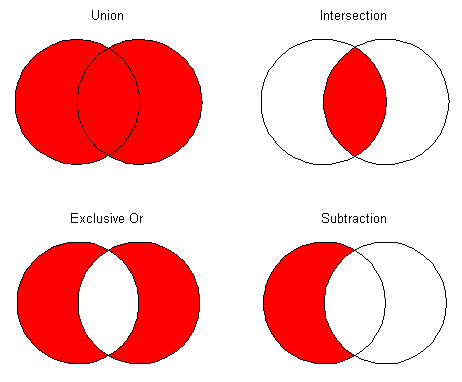
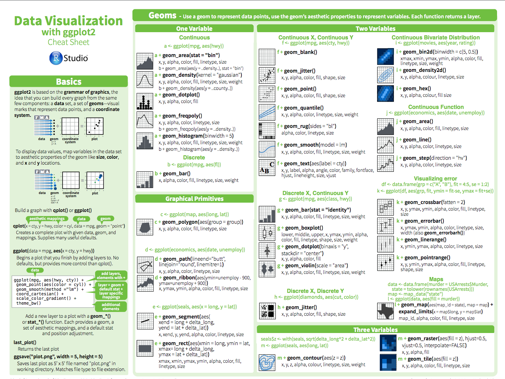
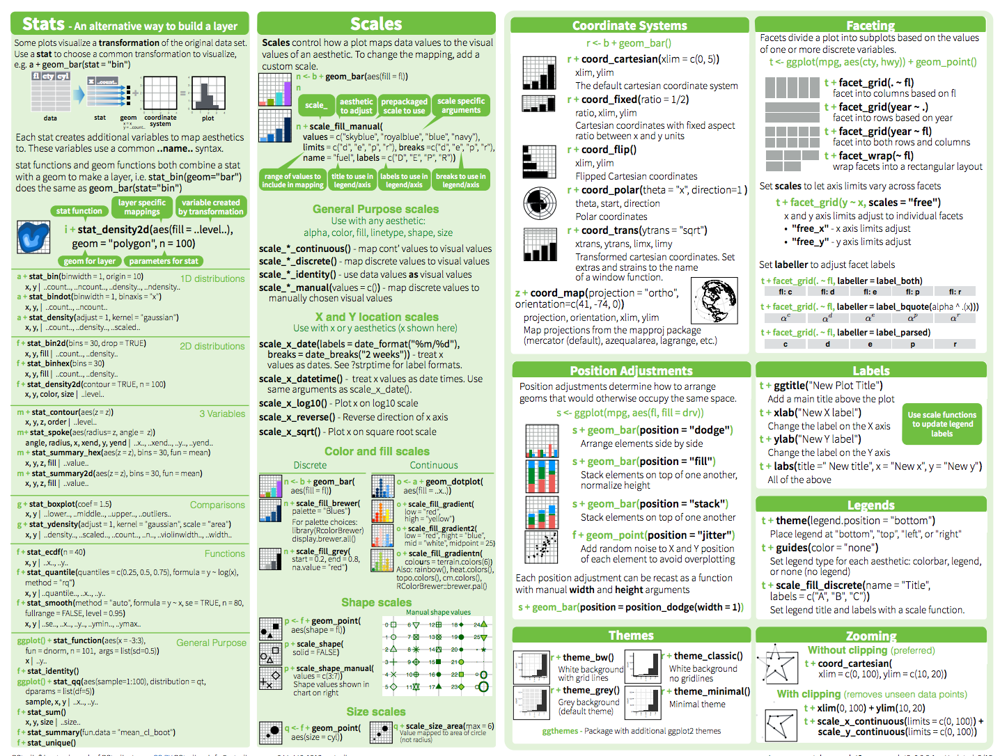

```{r setup, include=FALSE}
knitr::opts_chunk$set(echo = TRUE, eval = FALSE, fig.align = 'center',
                      fig.height = 3, fig.width = 8)
require('dplyr')
require('tidyr')
require('ggplot2')
require('plotly')
```

## Proposta
- R Básico
- Estrutura e Conceitos do R
- Importando Dados para o R
- Data Wrangling e Tranformation
- Visualização de Dado

## Onde R é utilizado
- Análise e Inferência Estatística;
- Plots Exploratórios;
- Análise Exploratória de Dados;
- Produção Automática de Relatórios;
- Machine Learning.

## Porque Utilizar o R
- Fácil e rápido de aprender;
- Grande número de pacotes feitos e mantidos pela comunidade;
- Fácil Integração com **Mark-Down** e **Tex** para produção de documentos;
- Boas ferramentas para lidar com arquivos estruturados e bancos de dados relacionais e não relacionais;
- Fácil integração com C, C++ e FOTRAN;
- Uma das melhores IDEs, o RStudio.

##  R Básico
### Funções de Ajuda
```{r}
?mean #Ajuda de uma função
help.search(topic = 'linear regression') #Ajuda por termo de busca
help(package = 'dplyr') #Ajuda em um pacote
help(topic = mean) #Ajuda em uma função
```

##  R Básico
### Criando Vetores
```{r, eval = TRUE}
c(23, 5, -123)
1:10
seq(from = 0, to = 10, by = 2)
rep(x = c(1,23,4), each = 3)
```

##  R Básico
### Selecionando Elementos por Posição
```{r, eval = TRUE}
letters[1:5]
letters[c(4, 20)]
letters[-(1:20)]
```
##  R Básico
### Selecionando Elementos por Valor
```{r, eval = TRUE}
letters[letters == 'b']
letters[letters %in% c('a', 'd', 'e')]
```

##  R Básico
### Selecionando Elementos por Nome
```{r, eval = TRUE}
auxVet <- c(valA = 23, valB = 32, valC = -32)
auxVet['valB']
```

## Tipos de Dado
### Integer:
  - Número pertencente ao conjunto ${\rm I\!N}$;
  
### Numeric:
  - Número pertencente ao conjunto ${\rm I\!R}$;
  
### Complex:
  - Número pertencente ao conjunto ${\rm I\!C}$;
  
## Tipos de Dado
### Character:
  - Characters ou Strings
  
### Factor:
  - Variável Categórica
  
### Dates:
  - Data formatada

## Estruturas de Dado
### Vetores :
  - É uma sequência de qualquer tipo de dado;

```{r, echo = TRUE, eval = TRUE}
c('foo', 'bar', 'baz')
```

```{r, echo = TRUE, eval = TRUE}
c(-3.2, 4.6, 5.1)
```

```{r, echo = TRUE, eval = TRUE}
1:10
```
  
## Estruturas de Dado
### Matrix : 
  - Estrutura bidimensional de tamanho pré-estabelecido para qualquer tipo de dado.
```{r, echo = TRUE, eval = TRUE}
matrix(data = 1:6, ncol = 3, nrow = 2)
```

```{r, echo = TRUE, eval = TRUE}
matrix(data = c('foo', 'baz', 'bar', 'faz'),
       ncol = 2, nrow = 2)
```
  
## Estruturas de Dado
### Arrays : 
  - Estrutura multidimensional de tamanho pré-estabelecido para qualquer tipo de dado.
```{r, eval = TRUE}
array(data = 1:12, dim = c(2,3,2))
```
  
## Estruturas de Dado
### Data Frames :
  - Uma estrutura de dados bidimensional que pode ter tipos de dados diferentes em cada coluna.
```{r, eval = TRUE}
data.frame(Name = c('John', 'Jack', 'Jose'),
           Age = c(20, 25, 22),
           Height = c(1.78, 1.92, 1.71))
```
  
## Estruturas de Dado
### Listas : 
  - Uma coleção de estrutar diferentes.
```{r, eval = TRUE}
list(Supermarket = data.frame(
  Product = c('Soup', 'Potatoes', 'Tooth Paste'),
  Quantity = c(3, 20, 2)),
  Date = Sys.Date())
```


## Controle de Fluxo
### Loop
```{r, eval = FALSE}
for(i in 1:5) {}
for(element in listOfThings) {}
```

```{r, eval = FALSE}
while(condition == TRUE) {}
while(condition) {}
```


## Controle de Fluxo
### Condicional
```{r, eval = FALSE}
if(condition == TRUE) {
  DoSomething()  
} if else(!condition2){
    DoSomethingElse()
} else{
    DoLastPossibleThing()
}
```

```{r, eval = FALSE}
ifelse(test == TRUE, DoTrueThing(), DoFalseThing())
```

## Controle de Fluxo
### Condicional
```{r, eval = FALSE}
switch(a, 
       'val1' = doVal1Thing(),
       'val2' = doVal2Thing(),
       doDefaultThing()
       )
```


## Relational Operators
- Menor que : '<'
- Menor ou igual que : '<='
- Maior que : '>'
- Maior ou igual que : '>='
- Exatamente igual a : '=='
- Diferente de : '!='

## R Básico - Operadores Lógicos
```{r, eval = TRUE}
TRUE == 1
```

```{r, eval = TRUE}
12 != 'b'
```

```{r, eval = TRUE}
12 >= 12
```

## R Básico - Operadores Lógicos
```{r, eval = TRUE}
10 > 9:11
```

```{r, eval = TRUE}
rep(10, 3) == 9:11
```

```{r, eval = TRUE}
9:11 == rep(10, 3)
```

## R Básico - Operadores Lógicos
-	Not : '!'
```{r, eval = TRUE}
!TRUE
```

```{r, eval = TRUE}
!2
```

```{r, eval = TRUE}
!FALSE
```

## R Básico - Operadores Lógicos
### And : '&' or '&&'
```{r, eval = TRUE}
TRUE & 1
``` 

```{r, eval = TRUE}
( (2:4) >= 3) & ( (2:4) <= 3)
```

```{r, eval = TRUE}
( (2:4) >= 3) && ( (2:4) <= 3)
```


## R Básico - Operadores Lógicos
### Or : '|' or '||'
```{r, eval = TRUE}
( (2:4) >= 3) | ( (2:4) == 2)
```

```{r, eval = TRUE}
( (2:4) >= 3) || ( (2:4) == 2)
```
```{r, eval = TRUE}
( (2:4) >= 3) || ( (2:4) == 3)
```


##  R Básico - Criando uma Funções
```{r, eval = TRUE}
MyFun <- function(inputVal, someFlag = TRUE){
    val = numeric()
    if(someFlag){ 
        val = inputVal + 1
    } else{
        val = inputVal * -1
    }
    list(Val = val,
         Flag = someFlag)
}
```

##  R Básico - Criando uma Funções
```{r, eval = TRUE}
MyFun(inputVal = 200)
MyFun(inputVal = 200, someFlag = FALSE)
```

##  R Básico - Funções Úteis
### Carregando e Instalando Pacotes
```{r}
install.packages(package = 'dplyr') #Instala pacote
library(package = 'dplyr') #Carrega Pacote, utilizar em ambiente global
require(package = 'dplyr') #Carrega Pacote, utilizar em ambiente inferiores
```

### Lidando com Diretórios
```{r}
getwd() #Pega diretório atual
setwd(dir = './../otherDirectory/') #Muda o diretório atual
dir(path = './') #Lista todos os arquivos e pastas do diretório
```

##  R Básico - Funções Úteis
### Lidando com Arquivos
```{r}
file.exists('input_file.txt')
file.create('output_file.xml')
file.remove('useless_file.csv')
```

## Guardando Seção do R
```{r, eval = FALSE}
save.image(file = 'my_env.Rdata') #Salva Ambiente Global
load(file = 'my_env.Rdata') #Carrega ambiente Global
saveRDS(object = myDF, file = 'my_env.rds') #Salva uma Variável
myDF <- readRDS(file = 'my_df.rds') #Carrega uma Variável
```

### Interagindo com o Sistema
```{r}
Sys.time() # Pega Hora do Sistema
system(command = 'python --version') #Roda comando na Terminal
Sys.sleep(1.5) #Faz o sistema Dormir
```

## Important Functions
### Imprimindo ao Usuário
```{r}
print('R is super \'cools\'') #Imprime Raw Characters 
cat('R is super \'cools\'') #Imprime Como no 'C'
```

### Outras funções
```{r, eval = TRUE}
paste("R", ' is like a ', 10) #Junta Strings
class(x = 'Something') #Retorna classe do objeto
sample(x = 10, size = 3) # Retorna Sequencia Aleatória
summary(object = iris)
```

##  R Básico - Funções Úteis
### Olhando um Data Set
```{r, eval = TRUE}
head(iris)
tail(iris, n = 2)
```

##  R Básico - Funções Úteis
### Testando Tipo do Dado
```{r, eval = TRUE}
is.na(NA)
is.null(NULL)
is.factor(LETTERS)
```

##  R Básico - Funções Úteis
### Mudando Tipo do Dado
```{r, eval = TRUE}
as.factor(LETTERS[1:4])
as.character(LETTERS[1:4])
as.integer(c(1.5, pi))
```
##  R Básico - Família Apply
- **apply()**;
- **sapply()**;
- **lapply()**;
- **mapply()**;
- **tapply()**;

##  R Básico - Família Apply
```{r, eval = TRUE}
auxDF <- iris[1:5, 1:3]
print(auxDF)
```

##  R Básico - Família Apply
```{r, eval = TRUE}
apply(auxDF , 1, mean )
```
```{r, eval = TRUE}
apply(auxDF , 2, mean )
```

##  R Básico - Família Apply
```{r, eval = TRUE}
auxListA <- list( a = 1:5, b = seq(0, 1, 0.25))
auxListB <- list( c = 5:1, d = -seq(0, 1, 0.25))
print(auxListA)
print(auxListB)
```

##  R Básico - Família Apply
```{r, eval = TRUE}
sapply(X = auxListA, FUN = sum )
lapply(X = auxListA, FUN = sum )
```

##  R Básico - Família Apply
```{r, eval = TRUE}
mapply(FUN = sum, auxListA, auxListB)
```
```{r, eval = TRUE}
tapply(X = 1:10, INDEX = rep(x = c('a', 'b'), each = 5 ), FUN = mean)
```

##  R Básico - Família Apply
### Outras funções
- **vapply()**;
- **rapply()**;
- **eapply()**;
- **dendrapply()**;
- etc.

# Estrutura e Conceitos do R
## Estrutura e Conceitos do R
#### Empty environment - Pai de Todos os Ambientes
- Parent: none
- Accesso: emptyenv()
#### Base environment - Ambiente do R base package
- Parent: empty environment
- Accesso: baseenv()
#### Global environment – Ambiente Normal de trabalho
- Parent: Ambiente do Ultimo pacote carregado
- Accesso : globalenv()
#### Current environment – Ambiente onde o R está rodando (pode ser um dos anteriores)
- Parent: empty environment
- Accesso: environment()

## Estrutura e Conceitos do R
```{r, eval = TRUE, echo = FALSE, out.width = "800px"}

```

## Estrutura e Conceitos do R - Guia de Etiqueta R
- **Arquivo = ** predict_ad_revenue.R 
- **Variável = ** vgClicks 
- **Função = ** CalculateAvgClicks 
- **Tamanho da Lina <= ** 80 characters 
- **Espaçamento = ** Sempre colocar espaço entre operadores ex: (if (debug), x + y)
- **Função de Pacote = ** packageName::packageFun()

## Estrutura e Conceitos do R - Guia de Etiqueta R
### Tabs
```{r}
plot(x    = x.coord,
     y    = data.mat[, MakeColName(metric, ptiles[1], "roiOpt")],
     ylim = ylim,
     xlab = "dates",
     ylab = metric,
     main = (paste(metric, " for 3 samples ", sep = "")))
```

```{r}
plot(x = x.coord,
     y = data.mat[, MakeColName(metric, ptiles[1], "roiOpt")],
     ylim = ylim,
     xlab = "dates",
     ylab = metric,
     main = (paste(metric, " for 3 samples ", sep = "")))
```

## Estrutura e Conceitos do R - Guia de Etiqueta R
### Chaves
```{r}
if (condition) {
  one or more lines
} else {
  one or more lines
}

if (is.null(ylim)) runFun()
```

# Importando Dados para o R
## Importando Dados para o R
- **readr :** Arquivos Texto(txt, csv, etc)
- **readxl :**xl e xlsx
- **jsonlite :**json
- **xml2 :**xml
- **DBI :**DB
- **httr :**Web Api
- **rvest :**Web Scrapping

## Importando Dados para o R
### readr - Funções
- **readr::read_csv()**
- **readr::read_csv2()**
- **readr::read_tsv()**
- **readr::read_table()**
- **readr::read_table2()**
- **readr::readr::read_delim()**

## Importando Dados para o R
### readr - Funções
- **file =** nome do arquivo
- **delim =** character de separação entre valores
- **quote =** character que mostr ser string
- **na =** character que é o valor de NA
- **skip =** número de linhas do cabeçalho
- **col_names =** nome das colunas
- **col_types =** tipo das colunas
- **comment =** string de comentários
- **n_max =** número máximo de linhas

# Tidyverse
## Tidyverse
```{r, eval = TRUE, echo = FALSE, out.width = "800px"}

```

## Tidyverse
- RStudio
- Hadley Wickham
- WICKHAM, Hadley . Tidy Data. Journal of Statistical Software, [S.l.], v. 59, Issue 10, p. 1 - 23, sep. 2014. ISSN 1548-7660

```{r, eval = TRUE, echo = FALSE, out.width = "300px"}
knitr::include_graphics("imgs/m56O6Wgf.jpg")
```

## Tidyverse
### Tidy Data
- Cada variável é uma coluna.
- Cada observação é uma linha.
- Cada tipo de unidade de observação forma uma tabela.

# Data Wrangling e Tranformation

## Data Wrangling e Tranformation
### Pacotes
- **tidyr**
- **dplyr**

## Data Wrangling e Tranformation
```{r, eval = TRUE, echo = FALSE, out.width = "600px", out.height = "450px"}

```

## Data Wrangling e Tranformation
```{r, eval = TRUE, echo = FALSE, out.width = "600px", out.height = "450px"}

```


## Data Wrangling e Tranformation
### Funções tidyr
- **tidyr::gather**
- **tidyr::spread**
- **tidyr::separate**
- **tidyr::unite**

## Data Wrangling e Tranformation
### tidyr::gather
```{r, eval = TRUE, echo = FALSE, out.width = "800px"}
knitr::include_graphics("imgs/gather.png")
```

## Data Wrangling e Tranformation
### tidyr::spread
```{r, eval = TRUE, echo = FALSE, out.width = "800px"}
knitr::include_graphics("imgs/spread.png")
```

## Data Wrangling e Tranformation
### Funções tidyr
```{r, eval = TRUE}
iris %>%
  tidyr::gather(key = flowerVar, value = flowerValue, -Species) %>%
  dplyr::sample_n(5)
```

## Data Wrangling e Tranformation
### Funções tidyr
```{r, eval = TRUE}
iris %>%
  tibble::rownames_to_column(var = 'Obs') %>%
  tidyr::gather(key = flowerVar, value = flowerValue, -Species, -Obs) %>% 
  tidyr::spread(key = flowerVar, value = flowerValue) %>%
  dplyr::sample_n(5)
```

## Data Wrangling e Tranformation
### Funções tidyr
```{r, eval = TRUE}
iris %>%
  tidyr::gather(key = flowerVar, value = flowerValue, -Species) %>%
  tidyr::unite(col = newKey, Species, flowerVar, sep = '_') %>%
  dplyr::sample_n(5)
```

## Data Wrangling e Tranformation
### Funções tidyr
```{r, eval = TRUE}
iris %>%
  tidyr::gather(key = flowerVar, value = flowerValue, -Species) %>%
  tidyr::separate(col = flowerVar, into = c('Type', 'Mesure')) %>%
  dplyr::sample_n(5)
```

## Data Wrangling e Tranformation
### Funções dplyr - Básicas
- **dplyr::%>%**
- **dplyr::filter**
- **dplyr::select**
- **dplyr::mutate**
- **dplyr::arrange**
- **dplyr::group_by**
- **dplyr::summarise**

## Data Wrangling e Tranformation
### Funções dplyr - Básicas
```{r, eval = TRUE}
iris %>%
    dplyr::filter(Species != 'setosa') %>%
    dplyr::mutate(PL = Petal.Length + Petal.Width,
                  SP = Sepal.Length + Sepal.Width) %>%
    dplyr::select(Species, PL, SP) %>%
    dplyr::group_by(Species) %>%
    dplyr::summarise(meanPL = mean(PL), maxSP = max(SP)) %>%
    dplyr::arrange(Species)
    
```

## Data Wrangling e Tranformation
### Funções dplyr - Subset por linha
- **dplyr::distinct** remove todos os valores duplicados
- **dplyr::sample_frac** seleciona linhas de forma aleatória
- **dplyr::sample_n** seleciona linhas de forma aleatória
- **dplyr::top_n** seleciona as primeiras linhas
- **dplyr::slice** seleciona linhas pelas posições

## Data Wrangling e Tranformation
### Funções dplyr - Subset por linha
```{r, eval = TRUE}
iris %>%
    dplyr::slice(c(12, 66, 100))
```
```{r, eval = TRUE}
iris %>%
    dplyr::sample_frac(0.02)
```

## Data Wrangling e Tranformation
### Funções dplyr - Subset por linha
```{r, eval = TRUE}
iris %>%
    dplyr::group_by(Species) %>%
    dplyr::top_n(1, Petal.Length)
```

## Data Wrangling e Tranformation
### Funções dplyr - Subset por Coluna
- **dplyr::select( dplyr::contains() )**
- **dplyr::select( dplyr::ends_with() )**
- **dplyr::select( dplyr::everything() )**
- **dplyr::select( dplyr::matches() )**
- **dplyr::select( dplyr::num_range() )**
- **dplyr::select( dplyr::one_of() )**
- **dplyr::select( dplyr::starts_with() )**
- **dplyr::select( FirstColumnName : LastColumnName )**
- **dplyr::select( -RemovableColumnName )**


## Data Wrangling e Tranformation
### Funções dplyr - Subset por Coluna - Regular Expression
```{r, eval = TRUE, echo = FALSE, out.width = "800px", out.height = "450px"}

```


## Data Wrangling e Tranformation
### Funções dplyr - Subset por Coluna
```{r, eval = TRUE}
iris %>%
    dplyr::group_by(Species) %>%
    dplyr::sample_n(1) %>% 
    dplyr::ungroup() %>%
    dplyr::select(dplyr::ends_with('Length'))
```

## Data Wrangling e Tranformation
### Funções dplyr - Subset por Coluna
```{r, eval = TRUE}
iris %>%
    dplyr::group_by(Species) %>%
    dplyr::sample_n(1) %>% 
    dplyr::ungroup() %>%
    dplyr::select(dplyr::contains('al'))
```

## Data Wrangling e Tranformation
### Funções dplyr - Subset por Coluna
```{r, eval = TRUE}
iris %>%
    dplyr::group_by(Species) %>%
    dplyr::sample_n(1) %>% 
    dplyr::ungroup() %>%
    dplyr::select(dplyr::matches('.[s]'))
```


## Data Wrangling e Tranformation
### Funções dplyr - Criando novas Colunas
- **dplyr::mutate**
- **dplyr::mutate_each**
- **dplyr::mutate_if**
- **dplyr::mutate_at**
- **dplyr::mutate_all**
- **dplyr::transmute**

## Data Wrangling e Tranformation
### Funções dplyr - Criando novas Colunas
```{r, eval = TRUE}
iris %>%
    dplyr::select(Sepal.Length : Petal.Length) %>%
    dplyr::sample_n(3) %>%
    dplyr::mutate_each(funs = dplyr::funs(myMean = mean),
                       dplyr::matches('Sepal') )
```

## Data Wrangling e Tranformation
### Funções dplyr - Criando novas Colunas
```{r, eval = TRUE}
iris %>%
    dplyr::group_by(Species) %>% 
    dplyr::sample_n(1) %>%
    dplyr::ungroup() %>%
    dplyr::transmute(Species = Species %>% as.numeric)
```

## Data Wrangling e Tranformation
### Funções dplyr - Criando novas Colunas
```{r, eval = TRUE}
iris %>%
    head() %>%
    dplyr::mutate_if(is.factor,
                     dplyr::funs( ifelse( is.na(.), 0, .) ) )
    
```

## Data Wrangling e Tranformation
### Funções dplyr - Joins
- **dplyr::left_join**
- **dplyr::right_join**
- **dplyr::full_join**
- **dplyr::inner_join**
- **dplyr::semi_join**
- **dplyr::anti_join**

## Data Wrangling e Tranformation
### Funções dplyr - Joins
```{r, eval = TRUE, echo = FALSE, out.width = "600px", out.height = "450px"}
knitr::include_graphics("imgs/joins.png")
```


## Data Wrangling e Tranformation
### Funções dplyr - Joins
```{r, eval = TRUE}
table01 <- iris %>%
            dplyr::filter(Species != 'virginica') %>%
            dplyr::group_by(Species) %>% 
            dplyr::summarise(meanPL = mean(Petal.Length)) %>%
            dplyr::ungroup()
```

```{r, eval = TRUE}
table02 <- iris %>%
            dplyr::filter(Species != 'setosa') %>%
            dplyr::group_by(Species) %>% 
            dplyr::summarise(medianPL = median(Petal.Length)) %>%
            dplyr::ungroup()
```

## Data Wrangling e Tranformation
### Funções dplyr - Joins
```{r, eval = TRUE}
print(table01)
print(table02)
```

## Data Wrangling e Tranformation
### Funções dplyr - Joins
```{r, eval = TRUE}
dplyr::inner_join(x = table01, y = table02, by = 'Species')
dplyr::full_join(x = table01, y = table02, by = 'Species')
```

## Data Wrangling e Tranformation
### Funções dplyr - Joins
```{r, eval = TRUE}
dplyr::left_join(x = table01, y = table02, by = 'Species')
dplyr::right_join(x = table01, y = table02, by = 'Species')
```

## Data Wrangling e Tranformation
### Funções dplyr - Joins
```{r, eval = TRUE}
dplyr::semi_join(x = table01, y = table02, by = 'Species')
dplyr::anti_join(x = table01, y = table02, by = 'Species')
```

## Data Wrangling e Tranformation
### Funções dplyr - Juntando Data Frames
- **dplyr::bind_rows**
- **dplyr::bind_cols**

## Data Wrangling e Tranformation
### Funções dplyr - Juntando Data Frames
```{r, eval = TRUE}
dplyr::bind_cols(table01, table02)
dplyr::bind_rows(table01, table02)
```

## Data Wrangling e Tranformation
### Funções dplyr - Opearções de Conjunto
- **dplyr::intersect**
- **dplyr::union**
- **dplyr::setdiff**

## Data Wrangling e Tranformation
### Funções dplyr - Operações de Conjunto
```{r, eval = TRUE, echo = FALSE, out.width = "600px", out.height = "450px"}

```


## Data Wrangling e Tranformation
### Funções dplyr - Opearções de Conjunto
```{r, eval = TRUE}
dplyr::intersect(x = iris[1:3, ], y = iris[2:4, ])
```

```{r, eval = TRUE}
dplyr::setdiff(x = iris[1:3, ], y = iris[2:4, ])
```

## Data Wrangling e Tranformation
### Funções dplyr - Opearções de Conjunto
```{r, eval = TRUE}
dplyr::union(x = iris[1:3, ], y = iris[2:4, ])
```


# Visualização de Dados
## Visualização de Dados
### Pacotes
- **ggplot2**
- **plotly**

## Visualização de Dados - ggplot2
### Idéias Básicas
- Pensar no Tipo da variável (Contínua, Discreta ou Fator).
- Pensar nas cores e seus significados.
- Pensar como cada variável pode ser codificada.


## Visualização de Dados - ggplot2
```{r, eval = TRUE, echo = FALSE, out.width = "600px", out.height = "450px"}

```

## Visualização de Dados - ggplot2
```{r, eval = TRUE, echo = FALSE, out.width = "600px", out.height = "450px"}

```

## Visualização de Dados - ggplot2
### ggplto2 - Uma Variável - Continua
```{r, eval = TRUE}
Data <- data.frame(X = log10(1:100) ,
                   Y = sin(1:100 * 0.04) + 0.025 * rnorm(n = 100) )
p <- ggplot2::ggplot(data= Data, aes(x = Y))
```

## ggplto2 - Uma Variável - Contínua
### Histograma
```{r, eval = TRUE}
p + ggplot2::geom_histogram(binwidth = 0.2) 
```

## ggplto2 - Uma Variável - Contínua
### Densidade
```{r, eval = TRUE}
p + ggplot2::geom_density(adjust = 1, kernel = "gaussian") 
```

## ggplto2 - Uma Variável - Contínua
### Densidade Culmulativa
```{r, eval = TRUE}
p + ggplot2::stat_ecdf(geom = "step", n = 10) 
```


## ggplto2 - Duas Variável - Contínua
### line, point, e smooth plots
```{r, eval = TRUE}
ggplot2::ggplot(data = Data, aes(x = X, y = Y)) +
  ggplot2::geom_line() +
  ggplot2::geom_point() +
  ggplot2::geom_smooth(method = "lm")
```

## ggplto2 - Duas Variável - 1 Contínua e 1 Discreta
### bar plots
```{r, eval = TRUE}
Data$Y <- round(abs(Data$Y) * 4 )
ggplot2::ggplot(data = Data, aes(x = factor(Y), y = X)) +
  ggplot2::geom_bar(stat = "identity") +
  ggplot2::coord_flip()
```


## ggplto2 - Duas Variável - 1 Continua e 1 Discreta
### box plot
```{r, eval = TRUE}
ggplot2::ggplot(data = Data, aes(x = factor(Y), y = X)) +
  ggplot2::geom_boxplot()
```


## ggplto2 - Duas Variável - 1 Continua e 1 Discreta
### silhueta plot
```{r, eval = TRUE}
ggplot2::ggplot(data = Data, aes(x = factor(Y), y = X)) +
  ggplot2::geom_violin()
```


## Adicionando Novas Variávies
Novas variáveis podem ser codificadas no gráfico por meio de :
- Grupos
- Cor
- Tamanho
- Preenchimento


## ggplot2::aes()
- x
- y
- z
- alpha
- colour
- fill 
- group
- linetype
- size
- shape


## ggplot2::labs
```{r, eval = FALSE}
ggplot2::ggplot(data = iris,
                aes(x = Sepal.Length, y = Sepal.Width,
                    size = Petal.Length / 2,
                    shape = factor(round(Petal.Width)),
                    color = Species)) + 
  ggplot2::geom_point() + 
  ggplot2::labs(title = 'Titulo', subtitle = 'Subtitulo',
                x = 'Titulo X', y = 'Titulo Y',
                colour = "Legenda Cor",
                caption = 'Rodape',
                shape = 'Legenda Formato',
                size = 'Legenda Tamanho')  + 
  ggplot2::theme(
    legend.justification = c("left", "top"),
    legend.margin = margin(2, 2, 2, 2) )
```

## ggplot2::labs
```{r, eval = TRUE, echo = FALSE, fig.height = 5}
ggplot2::ggplot(data = iris,
                aes(x = Sepal.Length, y = Sepal.Width,
                    size = Petal.Length,
                    shape = factor(round(Petal.Width)),
                    color = Species)) + 
  ggplot2::geom_point() + 
  ggplot2::labs(title = 'Titulo', subtitle = 'Subtitulo',
                x = 'Titulo X', y = 'Titulo Y',
                colour = "Legenda Cor",
                caption = 'Rodape',
                shape = 'Legenda Formato',
                size = 'Legenda Tamanho') + 
  ggplot2::theme(
    legend.justification = c("left", "top"),
    legend.margin = margin(2, 2, 2, 2) )
```


## ggplot - Extensões
- ggthemes
- ggtech 
- ggmap 
- ggforce 
- ggTimeSeries 
- ggradar 
- ggraph 
- geomnet
- ggnetwork
- gganimate 
- ggiraph

## ggplot - Extensões
- ggdendro
- corrplot
- ggfortify
- plotROC
- plotly

## plotly - plotly::ggplotly
```{r, eval = TRUE}
p <- iris %>%
      tidyr::gather(key = IrisVar, value = IrisVal, -Species) %>%
      ggplot2::ggplot(aes(x = IrisVar, group = Species,
                          y = IrisVal, fill = Species)) +
      ggplot2::geom_bar(stat = "identity", position = "dodge")
p
```

## plotly - plotly::ggplotly
```{r, eval = TRUE, warning = FALSE, message = FALSE}
plotly::ggplotly(p = p)
```

## plotly - lines 
```{r, eval = TRUE, warning = FALSE, message = FALSE, echo = FALSE}
month <- c('January', 'February', 'March', 'April', 'May', 'June', 'July',
         'August', 'September', 'October', 'November', 'December')
high_2000 <- c(32.5, 37.6, 49.9, 53.0, 69.1, 75.4, 76.5, 76.6, 70.7, 60.6, 45.1, 29.3)
low_2000 <- c(13.8, 22.3, 32.5, 37.2, 49.9, 56.1, 57.7, 58.3, 51.2, 42.8, 31.6, 15.9)
high_2007 <- c(36.5, 26.6, 43.6, 52.3, 71.5, 81.4, 80.5, 82.2, 76.0, 67.3, 46.1, 35.0)
low_2007 <- c(23.6, 14.0, 27.0, 36.8, 47.6, 57.7, 58.9, 61.2, 53.3, 48.5, 31.0, 23.6)
high_2014 <- c(28.8, 28.5, 37.0, 56.8, 69.7, 79.7, 78.5, 77.8, 74.1, 62.6, 45.3, 39.9)
low_2014 <- c(12.7, 14.3, 18.6, 35.5, 49.9, 58.0, 60.0, 58.6, 51.7, 45.2, 32.2, 29.1)

TemperatureData <- data.frame(month, high_2000, low_2000, high_2007, low_2007, high_2014, low_2014)

#The default order will be alphabetized unless specified as below:
TemperatureData$month <- factor(TemperatureData$month, levels = TemperatureData[["month"]])
```

```{r, eval = TRUE, warning = FALSE, message = FALSE}
head(TemperatureData)
```

## plotly - lines 
```{r, eval = FALSE, warning = FALSE, message = FALSE}
p <- plot_ly(TemperatureData,
             x = ~month, y = ~high_2014, 
             name = 'High 2014',
             type = 'scatter', mode = 'lines',
             line = list(color = 'rgb(205, 12, 24)', width = 4)
             )
```

## plotly - lines 
```{r, eval = FALSE, warning = FALSE, message = FALSE}
p <- p %>%
      add_trace(y = ~low_2014, name = 'Low 2014',
                line = list(color = 'rgb(22, 96, 167)',
                            width = 4)) %>%
      add_trace(y = ~high_2007, name = 'High 2007',
                line = list(color = 'rgb(205, 12, 24)', 
                            width = 4, dash = 'dash')) %>%
      add_trace(y = ~low_2007, name = 'Low 2007',
                line = list(color = 'rgb(22, 96, 167)', 
                            width = 4, dash = 'dash')) %>%
      add_trace(y = ~high_2000, name = 'High 2000',
                line = list(color = 'rgb(205, 12, 24)',
                            width = 4, dash = 'dot')) %>%
      add_trace(y = ~low_2000, name = 'Low 2000', 
                line = list(color = 'rgb(22, 96, 167)', 
                            width = 4, dash = 'dot'))
```

## plotly - lines 
```{r, eval = FALSE, warning = FALSE, message = FALSE}
p <- p %>%
      layout(title = "Average High and Low Temperatures in New York",
             xaxis = list(title = "Months"),
             yaxis = list (title = "Temperature (degrees F)"))
```


## plotly - lines 
```{r, eval = TRUE, warning = FALSE, message = FALSE, echo = FALSE}
plot_ly(TemperatureData,
             x = ~month, y = ~high_2014, 
             name = 'High 2014',
             type = 'scatter', mode = 'lines',
             line = list(color = 'rgb(205, 12, 24)', width = 4)
             ) %>%
      add_trace(y = ~low_2014, name = 'Low 2014',
                line = list(color = 'rgb(22, 96, 167)',
                            width = 4)) %>%
      add_trace(y = ~high_2007, name = 'High 2007',
                line = list(color = 'rgb(205, 12, 24)', 
                            width = 4, dash = 'dash')) %>%
      add_trace(y = ~low_2007, name = 'Low 2007',
                line = list(color = 'rgb(22, 96, 167)', 
                            width = 4, dash = 'dash')) %>%
      add_trace(y = ~high_2000, name = 'High 2000',
                line = list(color = 'rgb(205, 12, 24)',
                            width = 4, dash = 'dot')) %>%
      add_trace(y = ~low_2000, name = 'Low 2000', 
                line = list(color = 'rgb(22, 96, 167)', 
                            width = 4, dash = 'dot')) %>%
      layout(title = "Average High and Low Temperatures in New York",
             xaxis = list(title = "Months"),
             yaxis = list (title = "Temperature (degrees F)"))
```


## plotly - scatter
```{r, eval = TRUE}
p <- plot_ly(data = iris, x = ~Sepal.Length, y = ~Petal.Length,
             color = ~Species,
             type = 'scatter', mode = 'markers', 
             marker = list(size = 10)
             ) %>%
  layout(title = 'Styled Scatter',
         yaxis = list(zeroline = FALSE),
         xaxis = list(zeroline = FALSE))
```

## plotly - scatter 
```{r, eval = TRUE, warning = FALSE, message = FALSE}
p
```


## plotly - pie 
```{r, eval = TRUE, warning = FALSE, message = FALSE, echo = FALSE}
USPersonalExpenditure <- data.frame("Categorie"=rownames(USPersonalExpenditure), USPersonalExpenditure)
USPersonalExpenditure <- USPersonalExpenditure[,c('Categorie', 'X1960')]
```

```{r, eval = TRUE, warning = FALSE, message = FALSE}
USPersonalExpenditure
```

## plotly - pie
```{r, eval = TRUE, warning = FALSE, message = FALSE, fig.height = 3.8}
plot_ly(USPersonalExpenditure, labels = ~Categorie,
        values = ~X1960, type = 'pie') %>%
  layout(title = 'US Expenditures 1960',
         xaxis = list(showgrid = FALSE, zeroline = FALSE,
                      showticklabels = FALSE),
         yaxis = list(showgrid = FALSE, zeroline = FALSE,
                      showticklabels = FALSE))
```


## plotly - bar
```{r, echo = TRUE, eval = TRUE}
Animals <- c("giraffes", "orangutans", "monkeys")
SF_Zoo <- c(20, 14, 23)
LA_Zoo <- c(12, 18, 29)
ZooData <- data.frame(Animals, SF_Zoo, LA_Zoo)
ZooData
```

## plotly - bar
```{r, echo = TRUE, eval = TRUE}
plotly::plot_ly(ZooData, x = ~Animals, y = ~SF_Zoo,
        type = 'bar', name = 'SF Zoo') %>%
  plotly::add_trace(y = ~LA_Zoo, name = 'LA Zoo') %>%
  plotly::layout(yaxis = list(title = 'Count'),
                 barmode = 'group')
```

## plotly - histogram
```{r, echo = TRUE, eval = TRUE, eval = TRUE}
plotly::plot_ly(alpha = 0.6) %>%
  plotly::add_histogram(x = ~rnorm(500)) %>%
  plotly::add_histogram(x = ~rnorm(500) + 1) %>%
  plotly::layout(barmode = "overlay")
```


## plotly - boxplot
```{r, warning = FALSE, message = FALSE, eval = TRUE}
plotly::plot_ly(ggplot2::diamonds, x = ~cut, y = ~price, 
        color = ~clarity, type = "box") %>%
  plotly::layout(boxmode = "group")
```

## plotly - Heatmap
```{r, eval = TRUE, fig.height=5}
plotly::plot_ly(z = volcano, type = "heatmap")
```


## plotly - 3dSurface
```{r, eval = TRUE, fig.height=4.5}
plotly::plot_ly(z = ~volcano) %>% 
  plotly::add_surface()
```

## plotly - 3dSurface
```{r}
 plotly::plot_ly(type = 'mesh3d',
  x = c(0, 0, 1, 1, 0, 0, 1, 1),
  y = c(0, 1, 1, 0, 0, 1, 1, 0),
  z = c(0, 0, 0, 0, 1, 1, 1, 1),
  i = c(7, 0, 0, 0, 4, 4, 6, 6, 4, 0, 3, 2),
  j = c(3, 4, 1, 2, 5, 6, 5, 2, 0, 1, 6, 3),
  k = c(0, 7, 2, 3, 6, 7, 1, 1, 5, 5, 7, 6),
  intensity = seq(0, 1, length = 8),
  color = seq(0, 1, length = 8),
  colors = colorRamp(rainbow(8))
)
```

## plotly - 3dSurface
```{r, echo = FALSE, eval = TRUE, fig.height=5}
 plotly::plot_ly(type = 'mesh3d',
  x = c(0, 0, 1, 1, 0, 0, 1, 1),
  y = c(0, 1, 1, 0, 0, 1, 1, 0),
  z = c(0, 0, 0, 0, 1, 1, 1, 1),
  i = c(7, 0, 0, 0, 4, 4, 6, 6, 4, 0, 3, 2),
  j = c(3, 4, 1, 2, 5, 6, 5, 2, 0, 1, 6, 3),
  k = c(0, 7, 2, 3, 6, 7, 1, 1, 5, 5, 7, 6),
  intensity = seq(0, 1, length = 8),
  color = seq(0, 1, length = 8),
  colors = colorRamp(rainbow(8))
)
```

